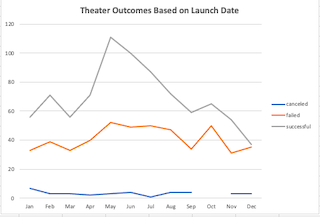
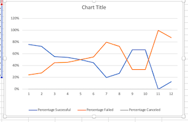

## Overview of Project
Louise's play Fever sparked a further curiosity about how her campaign launch dates relate to achieving her fundraising goals. 

### Purpose
Our challenge was to find correlation between the launch date and funding goals for Louise using our Kickstarter data set. 

**##Analysis and Challenges**

### Analysis of Outcomes Based on Launch Date

-Theatre launch dates in the summer months were more successful than theatre launches in the winter
-Even when Louise had theatre launches in the summer months she still only had a 50% success rate based on total number of failed theatre events vs. total number of successful theatre events

### Analysis of Outcomes Based on Goals

-Goals less than $1,000 were the most successful. The rate of success drops after goals beyond $25,000

### Challenges and Difficulties Encountered
-After working with the original Kickstarter spreadsheet for all modules, I noticed my data was off for our final challenge. I had to backtrack to figure out what was off. My assumption was a filter was still active. 

## Results

**What are two conclusions you can draw about the Outcomes based on Launch Date?**
- Louise would have a higher likelihood of success if she launched her theatre event in the summer

**What can you conclude about the Outcomes based on Goals?**
- Louise would have a higher likelihood of success if she kept her goals below $25,000

**What are some limitations of this dataset?**
- Louise has events all over the globe. Filtering by location may be helpful
- Number of backers needed in order to fill the goals would be helpful to see. 
- We also do not see attendance for Louise's events. 

**What are some other possible tables and/or graphs that we could create?**
- Filter by country 
- Filter by number of backers 
- Chart to show number of backers vs. goals 
